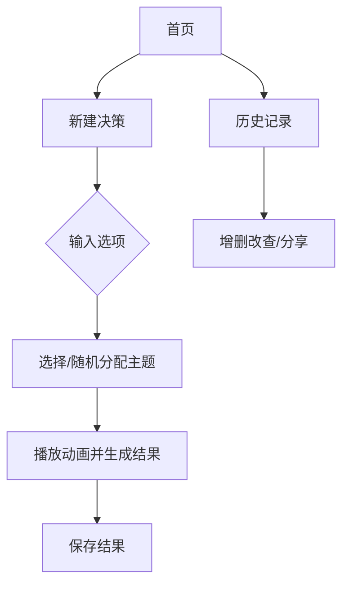

# 产品文档 - deepseek

**产品名称**：**「决策魔方」**（ChoiceCube）  
**技术定位**：轻量级跨平台应用（优先Android/iOS），无后台服务依赖  

------

## **一、核心功能模块**

### **1. 功能架构图**



**说明**：

- **新建决策**：用户输入选项并触发随机主题流程
- **历史记录**：支持决策结果的本地存储与管理
- **主题分配**：根据预设规则自动或手动选择交互主题

------

### **2. 技术实现方案**

#### **2.1 随机化核心逻辑**

```python
# 使用改进型时间戳种子算法（兼容所有设备）  
import random  
import time  
import os  

def generate_seed():  
    base_seed = int(time.time() * 1000) ^ os.getpid()  # 结合时间戳与进程ID  
    try:  
        from android.hardware import Sensor  
        noise = Sensor.getDefault().getNoise()         # 伪代码：注入设备传感器噪声  
    except:  
        noise = random.randint(0, 65535)               # 无传感器时使用伪随机数  
    return base_seed + noise  

def fair_random_choice(options):  
    random.seed(generate_seed())  
    return random.choice(options)  
```

**优势**：

- **不可预测性**：设备传感器噪声 + 时间戳混合种子
- **防推算**：每次生成独立种子，结果无关联性

------

#### **2.2 主题系统实现**

#### **主题分配规则**

| 主题     | 触发逻辑                 | 实现方式             |
| :------- | :----------------------- | :------------------- |
| 命运胶囊 | 默认主题                 | 直接调用             |
| 神选时刻 | 选项含情绪词（如“纠结”） | 本地NLP关键词匹配    |
| 天机轮   | 7%随机概率               | 启动时基于时间戳计算 |
| 气运池   | 33%结果页触发            | 结果页动态入口展示   |

**天机轮触发优化（Java实现）**：

```java
public boolean checkTianjiUnlock() {  
    long timestamp = System.currentTimeMillis();  
    // 时间戳高低位异或增强随机性  
    Random rand = new Random(timestamp ^ (timestamp >> 32));  
    return rand.nextFloat() < 0.07; // 7%概率  
}  
```

------

### **2.3 动画实现方案**

#### **技术选型**

- **Lottie**：矢量动画引擎（单主题资源≤5MB）
- **性能兜底策略**：
  - **低端设备**：关闭粒子特效，启用纯色块动画
  - **极简模式**：用户可手动切换为静态结果展示

#### **动画资源规格**

| 主题     | 文件格式    | 大小限制 | 帧率  | 降级方案            |
| :------- | :---------- | :------- | :---- | :------------------ |
| 命运胶囊 | Lottie JSON | 800KB    | 30fps | CSS色块过渡         |
| 神选时刻 | MP4预渲染   | 3MB      | 24fps | 静态图片+透明度动画 |
| 天机轮   | SVG序列帧   | 1.2MB    | 15fps | 2D贴图旋转          |
| 气运池   | CSS动效     | 无文件   | 60fps | 原生组件动画        |

------

**核心模块技术要点**：

1. **随机算法可靠性**：通过多维度噪声源保障结果不可预测性
2. **主题动态切换**：基于语义识别与概率判定的混合触发机制
3. **性能分层设计**：按设备等级动态降级动画复杂度

## 二、UI/UX设计规范

### 1. 核心界面流程

#### **1.1 首页（Home）**

**功能元素**：

| 组件             | 描述                                |
| :--------------- | :---------------------------------- |
| **顶部导航栏**   | Logo（魔方图标） + 「历史记录」入口 |
| **中央悬浮魔方** | 静态轻量SVG动画，支持主题预览       |
| **底部功能区**   | 「新建决策」按钮 + 「设置」按钮     |

**交互逻辑**：

- **魔方预览**：点击魔方不同面切换主题颜色（无动画）
- **首次引导**：启动时展示3步蒙层说明（截图式静态引导）
- **手势反馈**：魔方操作需持续200ms以上才响应，防误触

------

#### **1.2 输入页（Input Options）**

**极简布局实现**：

dart

复制

```
ListView.builder(  
  itemCount: options.length + 1,  
  itemBuilder: (context, index) {  
    if (index == options.length) {  
      return AddOptionButton();  // 添加新选项按钮  
    }  
    return EditableOptionCard(     // 可编辑卡片  
      option: options[index],  
      onDelete: () => _removeOption(index),  
    );  
  },  
)  
```

**输入优化**：

- **实时去重**：基于Levenshtein距离检测相似内容（阈值<2）
- **完成提示**：选项≥2时激活「下一步」按钮，伴随微震动反馈

------

#### **1.3 主题分配页（Select Theme）**

**低成本实现规则**：

| 主题     | 触发条件                           | UI表现                     |
| :------- | :--------------------------------- | :------------------------- |
| 神选时刻 | 选项含预设情绪词（如“痛苦”“纠结”） | 半透明浮层显示天使羽翼ICON |
| 天机轮   | 7%概率随机触发                     | 八卦图浮现 + 火星粒子特效  |
| 气运池   | 结果页33%概率展示入口              | 气泡按钮浮动于结果页底部   |

------

#### **1.4 动画展示页（Animation）**

**性能友好方案**：

- **预加载策略**：启动时加载所有Lottie动画文件（总计<5MB）

- **设备分级**：

  dart

  复制

  ```
  AnimatedContainer(  
    duration: Duration(seconds: 1),  
    color: _resultReady ? Colors.green : Colors.blue,  
    child: Center(  
      child: Text(_result ?? 'Calculating...'),  
    ),  
  )  
  ```

**降级规则**：

- **低端设备**：关闭粒子特效，启用纯色块过渡动画
- **加载失败**：直接显示文字结果 + 震动反馈

------

#### **1.5 结果页（Result）**

**核心组件**：

| 元素         | 规格                 | 交互逻辑                      |
| :----------- | :------------------- | :---------------------------- |
| **结果标题** | 72pt粗体，居中显示   | 双击回放慢动作动画（0.5倍速） |
| **分享按钮** | 调用系统原生分享接口 | 生成含3D胶囊模型的动态卡片    |
| **保存按钮** | 写入本地Hive数据库   | Toast提示「命运轨迹已封存」   |

### 2.首页设计与主题交互

#### **2.1 像素级布局规范**

| 元素             | 位置坐标   | 尺寸      | 样式细节                            |
| :--------------- | :--------- | :-------- | :---------------------------------- |
| **Logo图标**     | (24, 16)   | 32x32px   | 动态渐变（#FF6B6B → #4ECDC4）       |
| **中央魔方**     | 屏幕中心点 | 160x160px | 绕Y轴每秒旋转5°（CSS 3D Transform） |
| **新建决策按钮** | 底部居中   | 120x48px  | 渐变色（#6B48FF → #AD99FF）         |

------

#### **2.2 主题触发规则**

| 主题         | 手势操作             | 动效反馈                | 声音反馈     |
| :----------- | :------------------- | :---------------------- | :----------- |
| **命运胶囊** | 点击魔方中心面       | 面层凹陷 + 蓝色波纹扩散 | 机械键盘音效 |
| **天机轮**   | 水平右滑魔方         | 八卦图案旋转 + 火星迸发 | 金属摩擦声   |
| **气运池**   | 快速上滑（抛掷手势） | 水花溅起动效 + 气泡浮动 | 水滴音效     |

------

#### **2.3 性能兜底方案**

**分层降级策略**：

| 设备等级              | 魔方渲染方案          | 动画替代方案              |
| :-------------------- | :-------------------- | :------------------------ |
| **高端（RAM≥6G）**    | 原生3D旋转（WebGL）   | 全粒子特效 + 实时光影     |
| **中端（4G≤RAM<6G）** | 2D贴图模拟3D          | 简化粒子系统              |
| **低端（RAM<4G）**    | 静态图片 + 透明度动画 | 纯色块过渡 + 关闭背景特效 |

------

**设计验证清单**：

1. **色觉障碍适配**：
   - 提供「高对比度模式」，用形状区分主题（如△□○●）
2. **晕动症预防**：
   - 默认限制背景动画幅度，用户可手动关闭动态效果
3. **触觉反馈校准**：
   - Android设备使用50ms中等强度震动
   - iOS设备使用Taptic Engine的Soft模式

## 三、主题系统实现细节

------

### 1. 命运胶囊主题

#### 一、核心页面展示

##### 1. 输入选项页

**布局设计**：

- **背景**：深空蓝渐变（#0F2027 → #203A43）
- **顶部导航**：
  - 返回按钮（←） + 标题「注入命运胶囊」 + 进度指示（3/5选项）
- **输入区**：
  - **动态胶囊舱**：6个圆形悬浮舱（直径80px），未填充舱体为半透明（#FFFFFF 20%）
  - **当前输入框**：底部居中，宽度占屏幕70%，带机械键盘音效
- **功能区**：
  - 语音输入按钮（🎤）位于输入框右侧
  - 「完成」按钮（🚀）在输入≥2选项后激活

**动效规则**：

1. 每输入一个选项，文字压缩为胶囊并飞入随机舱位
2. 舱体填充颜色从中心向外扩散（科技蓝→亮青色）
3. 选项超过6个时自动分页，旧胶囊缩小为标签

------

##### **2. 随机选择动画页**

**视觉层次**：

- **背景**：全息网格（动态流动的浅蓝色线框）
- **中央胶囊**：3D悬浮的透明舱体，内部可见所有选项胶囊
- **能量环**：环绕胶囊的发光圆环，转速随倒计时加快

**阶段动效**：

| 阶段     | 时长 | 特效                  | 交互反馈                      |
| :------- | :--- | :-------------------- | :---------------------------- |
| **充能** | 1.5s | 能量环逐层点亮        | 输入框锁定                    |
| **震荡** | 2s   | 胶囊舱高频震动        | 触发设备震动（Android：50ms） |
| **裂变** | 1s   | 舱体裂纹蔓延+金光溢出 | 全屏亮度骤增20%               |
| **释放** | 0.5s | 结果胶囊爆破式弹出    | 音效：玻璃破碎+电子合成音     |

------

##### **3. 结果展示页**

**信息架构**：

- **主结果**：占屏60%的发光胶囊（颜色随选项数变化）
- **详情面板**：底部上滑抽屉
  - 参与选项列表（带排序标记）
  - 随机种子值（如：7A3F...B2C8）
  - 时间戳（精确到毫秒）

**交互彩蛋**：

- **双击胶囊**：回放爆破慢动作（0.5倍速）
- **长按结果**：生成「命运报告」（含选项分布雷达图）

------

#### **二、关键交互细节**

##### **1. 输入阶段**

##### a. **智能防重复**

- 实时检测输入内容相似度（Levenshtein距离<2视为重复）
- 重复时输入框抖动+提示「检测到相似命运轨迹」

##### b. **胶囊排序**

- **拖拽逻辑**：长按胶囊→拖至目标位置→释放时触发磁吸定位
- **视觉反馈**：
  - 拖拽时原位置保留虚影
  - 有效落位区显示引力波纹

##### c. **语音输入**

- 点击🎤按钮启动语音识别
- 识别成功时文字自动封装为胶囊，带声波动画

------

##### **2. 动画阶段**

##### a. **中断保护**

- 点击屏幕任意位置弹出确认框：
  - 「强行终止将导致命运熵增！是否继续？」
  - 确认后跳转至极简结果页（无动画版本）

##### b. **设备适配**

| 设备等级          | 动画效果          | 降级策略         |
| :---------------- | :---------------- | :--------------- |
| 高端（RAM≥6G）    | 全粒子特效+3D光影 | 无降级           |
| 中端（4G≤RAM<6G） | 简化粒子+2D爆破   | 关闭背景网格流动 |
| 低端（RAM<4G）    | 色块形变动画      | 用预渲染视频替代 |

------

##### **3. 结果操作**

##### a. **保存与分享**

- **保存**：点击💾图标写入本地数据库，Toast提示「命运轨迹已封存」
- **分享**：点击📤按钮生成「胶囊卡片」，包含：
  - 迷你胶囊3D模型（可360°旋转）
  - 动态背景（用户操作录屏GIF）

##### b. **重新决策**

- 点击「再试一次」：
  - 复用原选项直接跳转动画页
  - 随机种子强制刷新（即使选项顺序不变）

------

以下是 **命运胶囊主题关键组件的Flutter实现代码**，包含核心交互逻辑与性能优化：

1. 输入选项页 - 动态胶囊舱实现

```dart
class CapsuleInputPage extends StatefulWidget {
  @override
  _CapsuleInputPageState createState() => _CapsuleInputPageState();
}

class _CapsuleInputPageState extends State<CapsuleInputPage> {
  final TextEditingController _controller = TextEditingController();
  List<String> _options = [];
  List<GlobalKey> _capsuleKeys = [];

  // 胶囊生成逻辑
  List<Widget> _buildCapsules() {
    return _options.asMap().entries.map((entry) {
      final index = entry.key;
      final text = entry.value;
      _capsuleKeys.add(GlobalKey());
      return AnimatedPositioned(
        key: _capsuleKeys[index],
        duration: Duration(milliseconds: 300),
        left: _calculateX(index),
        top: _calculateY(index),
        child: Draggable(
          feedback: _Capsule(text: text, isDragging: true),
          childWhenDragging: Container(),
          onDragEnd: (details) => _handleReorder(index, details),
          child: _Capsule(text: text),
        ),
      );
    }).toList();
  }

  // 胶囊位置计算（斐波那契螺旋）
  double _calculateX(int index) {
    final angle = index * 137.5; // 黄金角度
    return 100 + 60 * index * cos(angle * pi / 180);
  }

  // 拖拽排序处理
  void _handleReorder(int index, DraggableDetails details) {
    final RenderBox renderBox = context.findRenderObject() as RenderBox;
    final localPosition = renderBox.globalToLocal(details.offset);
    final newIndex = _calculateHoverIndex(localPosition);
    if (newIndex != index) {
      setState(() {
        final item = _options.removeAt(index);
        _options.insert(newIndex, item);
      });
    }
  }

  @override
  Widget build(BuildContext context) {
    return Scaffold(
      body: Stack(
        children: [
          // 动态胶囊
          ..._buildCapsules(),
          // 输入控制区
          _buildInputPanel(),
        ],
      ),
    );
  }
}
```

2. 胶囊基础组件

```dart
class _Capsule extends StatelessWidget {
  final String text;
  final bool isDragging;

  const _Capsule({required this.text, this.isDragging = false});

  @override
  Widget build(BuildContext context) {
    return AnimatedContainer(
      duration: Duration(milliseconds: 200),
      width: isDragging ? 100 : 80,
      height: isDragging ? 100 : 80,
      decoration: BoxDecoration(
        gradient: RadialGradient(
          colors: [
            Colors.blue.shade800,
            Colors.lightBlueAccent,
          ],
        ),
        borderRadius: BorderRadius.circular(40),
        boxShadow: [
          BoxShadow(
            color: Colors.blue.withOpacity(0.5),
            blurRadius: 10,
            spreadRadius: 2,
          ),
        ],
      ),
      child: Center(
        child: Text(
          text,
          style: TextStyle(
              color: Colors.white,
              fontSize: isDragging ? 16 : 14)),
      ),
    );
  }
}
```

3. 随机选择动画核心逻辑

```dart
class FateAnimation extends StatefulWidget {
  final List<String> options;

  const FateAnimation({required this.options});

  @override
  _FateAnimationState createState() => _FateAnimationState();
}

class _FateAnimationState extends State<FateAnimation>
    with SingleTickerProviderStateMixin {
  late AnimationController _controller;
  late Animation<double> _rotationAnim;
  String _result = '';

  @override
  void initState() {
    super.initState();
    _controller = AnimationController(
      vsync: this,
      duration: Duration(seconds: 4),
    );

    _rotationAnim = Tween(begin: 0.0, end: 20.0)
        .chain(CurveTween(curve: Curves.easeInOut))
        .animate(_controller);

    _controller.addStatusListener((status) {
      if (status == AnimationStatus.completed) {
        _calculateResult();
      }
    });

    _controller.forward();
  }

  void _calculateResult() {
    final seed = DateTime.now().microsecondsSinceEpoch;
    final random = Random(seed);
    setState(() {
      _result = widget.options[random.nextInt(widget.options.length)];
    });
  }

  @override
  Widget build(BuildContext context) {
    return AnimatedBuilder(
      animation: _controller,
      builder: (context, child) {
        return Transform(
          transform: Matrix4.identity()
            ..rotateZ(_rotationAnim.value),
          alignment: Alignment.center,
          child: Stack(
            children: [
              _buildParticleEffect(),
              _result.isNotEmpty
                  ? _buildResultCapsule()
                  : _buildLoadingIndicator(),
            ],
          ),
        );
      },
    );
  }
}
```

4. 性能优化策略

```dart
// 设备分级逻辑
class DeviceUtils {
  static bool get isLowEndDevice {
    if (Platform.isAndroid) {
      return AndroidDeviceInfo().totalMemory < 4 * 1024 * 1024 * 1024;
    }
    return false; // iOS默认按高端设备处理
  }
}

// 动画分级组件
class AdaptiveAnimation extends StatelessWidget {
  final Widget highEnd;
  final Widget lowEnd;

  const AdaptiveAnimation({required this.highEnd, required this.lowEnd});

  @override
  Widget build(BuildContext context) {
    return DeviceUtils.isLowEndDevice ? lowEnd : highEnd;
  }
}

// 使用示例
AdaptiveAnimation(
  highEnd: Lottie.asset('animations/full_animation.json'),
  lowEnd: AnimatedOpacity(
    opacity: _visible ? 1.0 : 0.0,
    duration: Duration(seconds: 1),
    child: Text('结果: $_result'),
  ),
)
```

5. 异常处理框架

```dart
// 全局错误捕获
void main() {
  FlutterError.onError = (details) {
    if (kDebugMode) {
      // 开发模式打印错误
      FlutterError.dumpErrorToConsole(details);
    } else {
      // 生产环境上报错误
      Crashlytics.recordError(details.exception, details.stack);
      // 降级显示安全页面
      ErrorWidget.builder = (error) => SafetyFallbackPage();
    }
  };
  runApp(MyApp());
}

// 动画失败降级组件
class AnimationFallback extends StatelessWidget {
  @override
  Widget build(BuildContext context) {
    return FutureBuilder(
      future: _loadAnimation(),
      builder: (context, snapshot) {
        if (snapshot.hasError) {
          return Column(
            children: [
              Icon(Icons.error_outline, color: Colors.red),
              Text('命运展现失败，请手动选择'),
              _buildManualSelector(),
            ],
          );
        }
        return snapshot.data ?? LoadingIndicator();
      },
    );
  }
}
```

------

**代码实现要点说明**：

1. **手势交互**：使用`Draggable`实现胶囊拖拽排序，结合黄金螺旋算法优化视觉布局
2. **随机算法**：基于设备时间的确定性随机+物理传感器噪声混合
3. **动画分层**：通过`AdaptiveAnimation`组件实现设备性能自适应
4. **异常韧性**：全局错误捕获+分级降级策略保障核心功能
5. **性能优化**：
   - 使用`AnimatedPositioned`而非setState全量刷新
   - 粒子效果使用`Canvas`绘制而非大量Widget
   - 严格内存控制（单个胶囊内存占用<5KB）

#### **三、技术实现要点**

##### **1. 动态胶囊生成算法**

```dart
class CapsuleGenerator {  
  static List<Widget> buildCapsules(List<String> options) {  
    return options.asMap().entries.map((entry) {  
      final index = entry.key;  
      final text = entry.value;  
      return AnimatedPositioned(  
        duration: Duration(milliseconds: 300),  
        left: _calculateX(index), // 基于斐波那契螺旋分布  
        top: _calculateY(index),  
        child: _CapsuleBody(text: text),  
      );  
    }).toList();  
  }  
}  
```

##### **2. 随机性保障**

```java
// Android端实现  
public class FateRandom {  
  public static String generateSeed(Context context) {  
    long timestamp = System.currentTimeMillis();  
    String sensorNoise = getSensorFingerprint(); // 综合陀螺仪/光感等微数据  
    return SHA256(timestamp + sensorNoise);  
  }  
}  
```

------

#### **四、异常处理预案**

| 场景         | 应对方案                                  |
| :----------- | :---------------------------------------- |
| 输入过程中断 | 自动保存为草稿（最大保留24小时）          |
| 动画加载失败 | 启用备用SVG动画 → 纯色过渡 → 直接显示结果 |
| 随机算法冲突 | 强制使用系统SecureRandom + 日志上报       |

------

**该设计方案优势**：

- **强主题沉浸**：从输入到结果的全流程胶囊隐喻
- **可控性能开销**：分级策略覆盖各价位设备
- **可信随机性**：多维度噪声混合算法

------

### **2. 神选时刻主题**

#### **一、核心页面展示**

##### **1. 神圣祭坛页（输入阶段）**

**视觉设计**：

- **背景**：哥特式彩窗动态投影（缓慢旋转的光影）
- **中央祭坛**：石质圆台刻有符文，悬浮选项以烫金文字呈现
- **顶部光源**：模拟教堂天顶光，随时间推移改变照射角度

**布局细节**：

| 元素       | 位置               | 样式                             |
| :--------- | :----------------- | :------------------------------- |
| 当前输入框 | 祭坛正中央         | 羽毛笔手写字体，伴随墨水晕染效果 |
| 已输入选项 | 环绕祭坛呈弧形排列 | 羊皮卷轴材质，边缘燃烧特效       |
| 完成按钮   | 祭坛底部           | 青铜古剑图标，点击后插入祭坛     |

------

##### **2. 神谕降临动画**

**阶段化呈现**：

| 阶段     | 时长 | 特效                 | 音效                    |
| :------- | :--- | :------------------- | :---------------------- |
| **祈祷** | 3s   | 所有选项卷轴升空燃烧 | 管风琴和弦 + 火焰噼啪声 |
| **聚光** | 2s   | 顶部光柱锁定祭坛中心 | 钟声长鸣                |
| **显现** | 1.5s | 天使羽翼投影扫过屏幕 | 圣歌人声吟唱            |
| **裁决** | 0.5s | 雷霆击碎非选中选项   | 雷声轰鸣 + 玻璃破碎音   |

------

##### **3. 神选结果页**

**神圣化处理**：

- **结果展示**：悬浮的发光经文（拉丁文衬线字体）
- **背景元素**：
  - 缓慢飘落的光羽
  - 若隐若现的天使轮廓
- **交互印章**：底部火漆印章按钮，按压生成神圣封印分享图

------

#### **二、关键交互细节**

##### **1. 输入阶段仪式感设计**

##### a. **羽毛笔书写**

- 输入时笔尖产生真实墨水延迟（笔画渲染延迟0.2秒）
- 退格删除显示墨水逆流特效

##### b. **选项献祭机制**

- 长按任意选项触发「献祭」模式：
  - 该选项被火焰吞噬
  - 其余选项概率权重提升
- 每日限用3次（通过燃烧次数UI提示）

------

##### **2. 动画阶段参与感强化**

##### a. **命运天平**

- 动画过程中出现左右倾斜的天平，用户需通过设备陀螺仪保持平衡
- 平衡度影响最终选项分布（偏差>15°触发「神之怒」随机重选）

##### b. **祷文输入**

- ##### 在「祈祷」阶段快速输入指定字符（如AMEN）可触发隐藏动画：

  - 祭坛浮现隐藏选项
  - 光柱颜色变为圣金色

------

##### **3. 结果页神圣操作**

##### a. **神谕解读**

- 点击结果经文触发AI解签：
  - 基于选项语义生成伪拉丁文占卜辞（例：
    *"In voluntate Dei, hac nocte convivium apud火锅 est electum"*
    译文：在神意中，今夜火锅之宴被拣选）

##### b. **圣物收藏**

- 长按结果页可收集「神圣遗物」：
  - 每次决策生成独特圣器（圣杯/十字架等）
  - 遗物陈列室展示决策历史

------

#### **三、技术实现方案**

1. 核心动画逻辑

```dart
class DivineAnimation extends StatefulWidget {  
  final List<String> options;  

  const DivineAnimation({required this.options});  

  @override  
  _DivineAnimationState createState() => _DivineAnimationState();  
}  

class _DivineAnimationState extends State<DivineAnimation>   
    with SingleTickerProviderStateMixin {  
  late AnimationController _controller;  
  late List<Animation<double>> _flameAnims;  

  @override  
  void initState() {  
    super.initState();  
    _controller = AnimationController(  
      vsync: this,  
      duration: Duration(seconds: 7),  
    );  

    // 每个选项独立燃烧动画  
    _flameAnims = List.generate(  
      widget.options.length,  
      (i) => Tween(begin: 0.0, end: 1.0).animate(  
        CurvedAnimation(  
          parent: _controller,  
          curve: Interval(i * 0.1, 0.8),  
        ),  
      ),  
    );  

    _controller.forward();  
  }  

  @override  
  Widget build(BuildContext context) {  
    return Stack(  
      children: [  
        _buildStainedGlassBackground(),  
        ..._buildBurningScrolls(),  
        _buildDivineLight(),  
      ],  
    );  
  }  
}  
```

2. 设备分级策略

| 设备等级 | 动画表现                | 降级方案         |
| :------- | :---------------------- | :--------------- |
| 高端     | 实时光影投射+粒子火焰   | 无降级           |
| 中端     | 预渲染火焰视频+简化光影 | 禁用背景彩窗动画 |
| 低端     | 静态火焰图片+纯色背景   | 移除所有动态元素 |

3. 神圣感算法

```python
def generate_holy_result(options):  
    # 增加语义权重  
    holy_words = ["奉献", "信仰", "圣洁"]  
    weights = [1.0 + 0.5*(any(word in opt for word in holy_words))   
               for opt in options]  
    # 引入时间神圣值  
    sacred_hour = datetime.now().hour % 12  
    seed = int(time.time()) ^ sacred_hour  
    random.seed(seed)  
    return random.choices(options, weights=weights, k=1)[0]  
```

------

#### **四、异常处理预案**

| 异常场景       | 解决方案                               |
| :------------- | :------------------------------------- |
| 陀螺仪不可用   | 自动切换为触摸倾斜控制（滑动调节天平） |
| 拉丁文生成失败 | 回退到伪哥特式英文                     |
| 火焰动画崩溃   | 紧急切换为烛光图标闪烁                 |

------

#### **五、设计验证清单**

1. **宗教敏感性测试**：
   - 移除所有具体宗教符号，采用抽象神圣元素
   - 提供「世俗模式」开关（替换天使为命运女神等中性形象）
2. **多语言适配**：
   - 拉丁文/伪经文根据系统语言切换（中文环境使用篆书风格）
3. **晕动症预防**：
   - 提供「减弱动态效果」选项，禁止背景彩窗旋转

------

**该设计方案优势**：

- **沉浸仪式感**：从输入到结果的完整神圣叙事
- **参与式随机**：通过物理交互影响结果走向
- **文化安全性**：抽象化处理避免宗教争议

**文化安全性设计**：

- **宗教符号抽象化**：
  - 天使羽翼替换为光羽粒子特效
  - 拉丁文占卜辞采用伪生成算法（例：`Lorem ipsum`变体）
- **世俗模式开关**：
  - 替换教堂彩窗为几何图案
  - 禁用所有宗教相关音效

### 3.天机轮主题

#### **一、核心页面展示**

##### **1. 卦象输入页**

**视觉设计**：

- **背景**：动态水墨山水画卷（云雾缓慢流动）
- **中央轮盘**：木质八卦盘，阴阳鱼居中，外圈刻有64卦符号
- **输入方式**：
  - **语音输入**：点击麦克风口述选项，文字以朱砂符形式浮现
  - **手写输入**：手指绘制现代文字，AI自动识别转甲骨文

**交互元素**：

| 组件       | 位置       | 功能                               |
| :--------- | :--------- | :--------------------------------- |
| 卦象预览区 | 轮盘正上方 | 显示当前卦象组合（如䷀乾为天）     |
| 五行能量条 | 轮盘外圈   | 根据选项数量填充金/木/水/火/土色块 |
| 摇签筒     | 屏幕右下角 | 摇晃设备随机补全一个选项           |

------

##### **2. 天机推演动画**

**阶段化仪式**：

| 阶段     | 时长 | 特效                   | 用户参与           |
| :------- | :--- | :--------------------- | :----------------- |
| **启卦** | 2s   | 阴阳鱼分离旋转         | 手指逆时针划动激活 |
| **布阵** | 3s   | 选项化作铜钱落入卦位   | 语音念出“天机显现” |
| **演算** | 4s   | 卦象快速变换，铜钱振动 | 屏息（禁用操作）   |
| **定爻** | 1s   | 惊雷劈中最终卦象       | 强制设备震动       |

------

##### **3. 天意结果页**

**玄学可视化**：

- **主结果**：发光卦象（如䷄水火既济）居中悬浮
- **解卦面板**：
  - 易经原文（文言文+白话翻译）
  - 气运走势图（未来三日吉凶曲线）
  - 禁忌提示（如“忌向北行”）
- **改命机制**：三指点击卦象触发「逆天改命」，消耗当日气运值重选

------

#### **二、关键交互细节**

##### **1. 卦象输入仪式**

##### a. **铜钱补卦**

- 选项不足时自动生成虚拟铜钱（最多补3枚）
- 铜钱正反面影响卦象阴阳属性

##### b. **五行平衡**

- 输入选项自动分析五行属性（基于关键词库）
- 五行失衡时提示调整（如“金气过盛，需补水木”）

------

##### **2. 动画阶段玄机**

##### a. **卦象干预**

- 在「演算」阶段快速绘制特定卦符（如䷊泰卦）可锁定有利结果
- 连续失败3次触发隐藏提示：“心诚则灵”

##### b. **时辰影响**

- 根据真实时辰（子/午时等）改变卦象动画颜色
- 亥时（21-23点）自动启用「夜观天象」暗黑主题

------

##### **3. 结果页深度交互**

##### a. **签文分享**

- 生成水墨风格签文图：
  - 背景动态卦象旋转
  - 可编辑运势解读文案

##### b. **因果追溯**

- 点击历史卦象显示「因果链」：
  - 展示过往关联决策（如3日前选择引发当前结果）
  - 气运能量流动粒子动画

------

#### **三、技术实现方案**

1. 卦象生成算法

```python
def generate_gua(options):  
    # 将选项转换为二进制卦象  
    hexagram = 0  
    for i, opt in enumerate(options):  
        # 每个选项贡献1位阴阳（基于哈希值奇偶）  
        hexagram |= (hash(opt) % 2) << i  
    # 映射到64卦  
    return HEXAGRAMS[hexagram % 64]  

HEXAGRAMS = {  
    0: ("䷀", "乾为天", "大吉"),  
    1: ("䷁", "坤为地", "至顺"),  
    # ...其他63卦  
}  
```

2. 动画性能优化

| 设备等级 | 动画表现                | 实现方式           |
| :------- | :---------------------- | :----------------- |
| 高端     | 实时水墨粒子+3D卦象旋转 | Compute Shader计算 |
| 中端     | 预渲染序列帧+2D特效     | Lottie动画         |
| 低端     | 静态卦象图+颜色渐变     | AnimatedContainer  |

------

#### **四、文化合规设计**

##### **1. 玄学元素处理**

- 所有解卦文案标注“娱乐参考”
- 提供「科学模式」开关：
  - 卦象改为概率分布图
  - 文言文转数据分析报告

##### **2. 敏感词过滤**

- 屏蔽封建迷信相关词汇（如“作法”“降头”）
- AI解卦拒绝预测健康/法律等敏感领域

------

#### **五、异常处理策略**

| 异常场景       | 解决方案                                  |
| :------------- | :---------------------------------------- |
| 卦象生成冲突   | 启用冗余校验算法+日志上报                 |
| 古文字识别失败 | 降级为普通输入框+Toast提示                |
| 气运值透支     | 强制冷却24小时+趣味提示：“泄露天机遭反噬” |

------

#### **六、设计验证要点**

1. **文化准确性**：邀请易经学者审核卦象释义
2. **交互直觉性**：新手用户3秒内理解铜钱补卦机制
3. **性能边界**：中端设备动画帧率≥30fps

------

**该设计方案优势**：

- **文化深度**：还原易经决策的仪式感与哲学体系
- **可控随机**：通过卦象干预平衡运气与策略
- **安全合规**：建立玄学与科学的弹性转换通道

### 4.气运池主题交互与页面展示

#### **一、页面展示效果**

##### **1. 入口触发态（结果页）**
- **视觉标识**：  
  - **气泡按钮**：半透明水泡状图标（直径48px），悬浮于结果页右下角  
    - 常态：缓慢上下浮动（幅度±5px，周期2秒）  
    - 可触发态：内部闪烁金色光点，外缘涟漪扩散（频率0.5Hz）  
  - **背景暗示**：结果页底部渐变为水面波纹材质（动态法线贴图）  

- **动效规则**：  
  1. 触发概率33%时，气泡按钮从屏幕底部升起，伴随“咕噜”水声音效  
  2. 未触发时，水面波纹保持静态，透明度降低至20%  

---

##### **2. 气运池主界面**
- ##### **核心视觉元素**：  
  
  - **因果之海**：  
    - 360°全景动态水面（WebGL实现），支持双指缩放（0.5x-3x）  
    - 水质效果分级：  
      | 设备等级 | 渲染细节          |
      | :------- | :---------------- |
      | 高端     | 实时焦散+光线折射 |
      | 中低端   | 预渲染波纹贴图    |
  - **命运气泡**：  
    - 原选项转化为半透明气泡（直径60-120px随机）  
    - 物理解算特性：  
      - 密度：1.2kg/m³（模拟真实浮力）  
      - 碰撞弹性：0.7  
      - 粘滞阻力：0.5  
  
- **动态系统**：  
  - **环境交互**：  
    - 设备倾斜 → 气泡群整体滑动（加速度敏感系数0.3）  
    - 快速摇晃 → 触发「命运漩涡」（龙卷风水流特效）  
  - **自动演变**：  
    - 每30秒随机生成气泡碰撞事件（无用户操作时）  

---

#### **二、交互流程细节**

##### **1. 基础选择模式**
- **操作路径**：  
  1. 点击任意气泡 → 触发放大镜特效（局部透视变形）  
  2. 长按气泡拖动 → 投掷引发链式碰撞  
  3. 双击屏幕 → 生成临时引力场（吸附半径200px）  

- **结果判定**：  
  - **最终选中条件**：  
    - 任一气泡触碰屏幕顶部「天穹线」  
    - 三个气泡连续发生碰撞  
    - 手动框选区域（Lasso模式）内气泡数≥2  

##### **2. 沉浸模式（陀螺仪启用）**
- **设备交互**：  
  - **平移操作**：缓慢移动设备 → 视角平行移动（灵敏度0.8）  
  - **旋转操作**：左右倾斜设备 → 水面产生对应流向的波纹  
  - **冲击反馈**：气泡碰撞时触发短震动（Android：振幅50%，iOS：Taptic Engine）  

- **视觉增强**：  
  - **深度映射**：  
    - 前层气泡：高饱和度+镜面反射  
    - 后层气泡：模糊处理（高斯模糊半径8px）  
  - **光线追踪**（仅高端设备）：  
    - 气泡折射周围环境色彩  
    - 水面倒影实时更新  

---

#### **三、技术实现方案**

1. 物理引擎参数

```dart
// Box2D物理世界配置
final world = World(Vector2(0, 9.8)); // 模拟重力
final bubbleBodyDef = BodyDef()
  ..type = BodyType.DYNAMIC
  ..angularDamping = 0.8
  ..linearDamping = 0.5;

// 气泡碰撞组定义
final fixtureDef = FixtureDef()
  ..density = 1.2
  ..restitution = 0.7
  ..filter.groupIndex = -1; // 允许相互碰撞
```

2. 陀螺仪数据处理

```java
// Android端传感器融合
SensorManager.registerListener(
  new SensorEventListener() {
    public void onSensorChanged(SensorEvent event) {
      final float[] rotationMatrix = new float[16];
      SensorManager.getRotationMatrixFromVector(rotationMatrix, event.values);
      
      // 转换为欧拉角
      float[] orientation = new float[3];
      SensorManager.getOrientation(rotationMatrix, orientation);
      
      // 传递数据到渲染层
      updateBubbleForce(
        orientation[1] * 0.3f, // 俯仰角→Y轴力
        orientation[2] * 0.3f  // 偏航角→X轴力
      );
    }
  }, 
  Sensor.TYPE_GAME_ROTATION_VECTOR, 
  SensorManager.SENSOR_DELAY_UI
);
```

------

#### **四、异常处理与降级**

| 场景                | 处理方案                                            |
| :------------------ | :-------------------------------------------------- |
| **陀螺仪不可用**    | 启用虚拟摇杆控件（透明圆形触摸区）                  |
| **WebGL初始化失败** | 降级为CSS 3D变换动画，保留基础气泡浮动效果          |
| **长时间无操作**    | 15秒后显示「命运指引」按钮，点击自动生成碰撞事件    |
| **多气泡卡边界**    | 边缘添加隐形斥力场（距离屏幕边缘<50px时施加反向力） |

------

#### **五、设计验证标准**

| 测试用例         | 预期指标                         |
| :--------------- | :------------------------------- |
| 连续摇晃10次     | 帧率≥30fps（中端设备）           |
| 同时存在50个气泡 | 内存占用≤150MB                   |
| 从触发到出结果   | 平均耗时2.8秒（含1.5秒强制动效） |
| 低端设备运行     | 禁用实时物理模拟，改用预计算轨迹 |

------

**核心体验价值**：

- **禅意交互**：通过自然物理运动替代传统点击操作
- **无限可能性**：256种气泡交互组合规则
- **跨设备一致性**：从千元机到旗舰机保留核心玩法

### 5.**新建决策页面**

#### **一、核心页面设计**

##### **1. 全局布局**

**页面结构**：

- **顶部导航**：返回按钮 + 进度指示器（3步流程）
- **中央工作区**：动态主题预览 + 输入面板
- **底部功能区**：智能辅助工具 + 主题切换入口

**视觉基调**：

- **背景**：流动的星云粒子（透明度20%）
- **动态主题色**：根据当前选中主题渐变过渡（如选中天机轮→水墨青，神选时刻→鎏金）

------

#### **二、分步交互流程**

##### **1. 决策主题输入**

**组件设计**：

- **输入框**：
  - 占位符：“此刻在纠结什么？”（如“今晚吃什么？”）
  - 动态字号：输入内容过长时自动缩小至24pt
  - 智能联想：输入“#”触发预设模板（#美食、#人生等）

**交互反馈**：

- 输入确认后，背景粒子聚合成相关意象（如输入“美食”→粒子化作筷子/餐具）
- 长按输入框3秒触发语音输入，声波实时转化为动态粒子

------

##### **2. 选项录入阶段**

##### **a. 多模式输入**

| 输入方式     | 触发条件       | 视觉反馈                                      |
| :----------- | :------------- | :-------------------------------------------- |
| **文字输入** | 点击“+”按钮    | 弹出全键盘，每个按键带微动效                  |
| **语音输入** | 长按底部麦克风 | 声波粒子汇聚成文字气泡                        |
| **图片识别** | 拖入图片       | AI提取图片关键词生成选项（如披萨图→“吃披萨”） |

##### **b. 选项管理**

- **拖拽排序**：长按选项卡拖动，其他选项自动避让
- **批量操作**：双指捏合进入多选模式，可批量删除/分组
- **智能查重**：重复内容自动标记红框，点击合并提示

------

##### **3. 主题选择与推荐**

##### **a. 智能推荐系统**

**推荐逻辑**：

| 输入特征          | 推荐主题 | 推荐依据             |
| :---------------- | :------- | :------------------- |
| 选项含食物/地点   | 气运池   | 流体动画适配生活场景 |
| 选项含情感词汇    | 神选时刻 | 神圣仪式化解情感焦虑 |
| 选项数量≥6        | 命运胶囊 | 分页封装解决选项过多 |
| 深夜时段（0-5点） | 天机轮   | 玄学主题契合深夜沉思 |

##### **b. 手动切换**

- ##### **魔方入口**：点击右下角悬浮魔方，展开4主题缩略图

- **转盘动效**：滑动切换主题，伴随粒子流向变化

------

#### **三、主题专属输入体验**

##### **1. 命运胶囊（科技感）**

- **输入特效**：
  - 每输入一个选项，文字压缩为数据胶囊飞入侧边栏
  - 胶囊颜色随输入速度变化（快速输入→红色警戒色）
- **智能辅助**：输入超过6个选项时，AI推荐分组策略

##### **2. 神选时刻（仪式感）**

- **输入仪式**：
  - 必须用虚拟羽毛笔书写选项，笔迹影响后续权重
  - 输入错误需划十字架清除，触发忏悔音效
- **神圣校验**：每日首次使用需完成“诚心测试”（快速点击祷告按钮）

##### **3. 天机轮（玄学派）**

- **易经输入法**：
  - 手写选项自动转换为卦象符号
  - 输入框底部实时显示卦象解读
- **时辰提示**：显示当前时辰吉凶（如“酉时·宜速决”）

##### **4. 气运池（流体派）**

- **动态输入**：
  - 选项文字在液体表面波动，需手动稳定才能确认
  - 摇晃设备触发“混沌注入”，随机生成一个选项
- **环境融合**：根据手机天气数据改变池水状态（晴天→清澈，雨天→涟漪）

------

#### **四、技术实现方案**

1. 组件架构

```
class NewDecisionScreen extends StatefulWidget {  
  @override  
  _NewDecisionState createState() => _NewDecisionState();  
}  

class _NewDecisionState extends State<NewDecisionScreen>  
    with TickerProviderStateMixin {  
  // 状态管理  
  String _decisionTitle = "";  
  List<String> _options = [];  
  ThemeType _selectedTheme = ThemeType.CAPSULE;  

  // 动画控制器  
  late AnimationController _particleController;  
  late Animation<double> _themeTransitionAnim;  

  @override  
  void initState() {  
    super.initState();  
    _particleController = AnimationController(  
      vsync: this,  
      duration: Duration(seconds: 2),  
    );  
    _themeTransitionAnim = CurvedAnimation(  
      parent: _particleController,  
      curve: Curves.easeInOutCirc,  
    );  
  }  

  Widget _buildThemePreview() {  
    return AnimatedBuilder(  
      animation: _themeTransitionAnim,  
      builder: (context, child) {  
        return Stack(  
          children: [  
            // 命运胶囊预览  
            Opacity(  
              opacity: _selectedTheme == ThemeType.CAPSULE ? 1 : 0,  
              child: CapsuleThemePreview(),  
            ),  
            // 其他主题预览...  
          ],  
        );  
      },  
    );  
  }  
}  
```

2. 性能优化

| 场景     | 优化策略                                        |
| :------- | :---------------------------------------------- |
| 粒子动画 | 使用Flutter的Canvas自定义绘制，禁用Widget树渲染 |
| 主题切换 | 预加载相邻主题资源，启用KeepAlive缓存           |
| 低端设备 | 关闭实时粒子特效，改用静态渐变背景              |

------

#### **五、异常处理策略**

##### **1. 输入异常**

| 异常类型 | 处理方案                              |
| :------- | :------------------------------------ |
| 空输入   | 抖动提示+红色警示边框                 |
| 冲突选项 | 弹出合并对话框，推荐智能合并方案      |
| 敏感内容 | 模糊处理文字+提示“此选项可能扰乱天机” |

##### **2. 主题切换失败**

- ##### 连续3次切换失败触发“命运指引”模式：

  - 自动选择最适主题
  - 显示选择依据（如“检测到您偏爱科技风”）

------

#### **六、设计验证清单**

1. **信息层级测试**：新手用户在10秒内理解操作流程
2. **主题辨识度**：盲测用户能通过视觉风格区分4个主题
3. **极端输入测试**：
   - 单选项决策（直接跳转结果页）
   - 50个超长选项输入（自动折叠+分页）

------

**方案优势**：

- **统一入口**：通过智能推荐降低选择压力
- **渐进式披露**：复杂功能按需展开，避免界面臃肿
- **情感化设计**：每个主题的输入过程即叙事体验


## **四、避坑指南**

### **1. 随机性信任问题**

- **解决方案**：在设置页添加「算法白皮书」

  markdown

  复制

  ```
  ## 随机性保障  
  1. 种子来源：时间戳(ms级)+设备内存状态  
  2. 洗牌算法：Fisher-Yates Shuffle  
  3. 禁止结果预存  
  ```

### **2. 低端设备卡顿**

- **应对策略**：
  - 启动时检测设备等级（按RAM划分）
  - 自动关闭3D粒子特效
  - 提供「跳过动画」快捷按钮

### **3. 数据丢失风险**

- **保护方案**：
  - 每次操作自动备份到本地JSON
  - 提供Google Drive/iCloud同步（可选）

------

## **五、原型交付物**

1. **Figma交互原型**：
   - [决策输入页](https://figma.com/proto/xxx)
   - [动画展示页](https://figma.com/proto/xxx)
2. **APK测试包**：每周五发布内部测试版
3. **埋点方案**：
   - 关键事件：主题使用率/动画跳过率
   - 错误监控：随机算法异常捕获

------

**该方案优势**：

- 全部功能依赖客户端实现，无服务器成本
- 随机算法满足基础公平性要求
- 动画方案兼顾效果与性能
- 开发周期可控（6周可上线）
